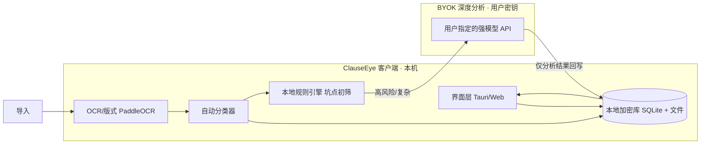

# ClauseEye（契眼）设计文档

> 版本：v0.1 · 状态：方案设计 · 最后更新：2026-09-17
> 配套文档：`docs/产品方案_PRD.md`

---

## 1. 设计原则

1. **本地优先（Local-first）**：文档与索引默认全部存本机，离线可用。
2. **零数据持有（Zero-holding）**：服务端不留存任何用户合同；BYOK 模式下数据只流向用户指定的模型厂商。
3. **可验证的隐私**：提供"离线模式"开关，关闭后纯本地运行，行为可被用户审计。
4. **规则兜底 + 模型增强**：本地规则引擎保证基础可用与可解释，强模型（BYOK）做深度增强。

---

## 2. 总体架构



要点：
- 文档**永不离开本机**；BYOK 调用只发送"待分析文本片段 + 用户 Key"，结果回写本地。
- 本地规则引擎离线即可产出坑点清单，BYOK 为可选增强。

---

## 3. 技术选型（推荐）

| 层 | 选型 | 理由 |
|---|---|---|
| 桌面壳 | **Electron**（实际采用，见 §10）／Tauri（备选） | 开发机无 MSVC 工具链，Electron 可直接产出免安装 exe；Tauri 体积更小，后续可替换 |
| 前端 | React + TypeScript + Vite | 生态成熟，便于做对比矩阵等交互 |
| 本地存储 | **IndexedDB + AES-GCM**（实际采用，逐条记录加密）／SQLite(SQLCipher)（备选） | 零依赖、跨壳可用；SQLCipher 需原生编译，暂不引入 |
| OCR/版式 | **tesseract.js**（实际采用，WASM，语言包随包分发）／PaddleOCR + PP-Structure（备选） | 免原生编译、可完全离线；PaddleOCR 需要 MSVC 编译环境 |
| 主密钥保护 | **Electron safeStorage**（Windows DPAPI / macOS 钥匙串） | 无口令模式下也能让密钥"绑定到当前系统账号"，无需 SQLCipher |
| 分类/抽取 | 本地规则 + 轻量模型（如端侧 GLM 类） | 离线初筛 |
| 深度分析 | **BYOK**：DeepSeek / 通义 / OpenAI（用户 Key） | 强模型质量，成本用户担 |
| 分析底座 | **OpenContracts**（MIT，可自托管） | 条款抽取/标注/RAG/版本对比参考实现 |
| 法律大脑参考 | ChatLaw / LaWGPT / LexiLaw | 坑点语义理解（需严格防幻觉） |

> 替代：若走"自托管 Web"而非桌面端，可直接用 OpenContracts 的 Docker 部署做底座，前端在其上叠加"个人保险箱 + 多 Offer 对比"模块。

---

## 4. 数据模型（草案）

```mermaid
erDiagram
    DOCUMENT ||--o{ CLAUSE : 包含
    DOCUMENT ||--o{ RISK_FLAG : 触发
    DOCUMENT }o--|| CATEGORY : 归属
    OFFER ||--o{ OFFER_FIELD : 含字段
    DOCUMENT ||--o{ OFFER : 可由Offer文档生成

    DOCUMENT {
        string id PK
        string title
        enum category
        string filePath        %% 本地加密文件
        datetime importedAt
        string sourceHash
    }
    CATEGORY {
        string code PK
        string name            %% 劳动合同/租房/离职证明/工伤鉴定/Offer
        string rulePackId
    }
    CLAUSE {
        string id PK
        string docId FK
        int page
        text snippet
        string type            %% 试用期/违约金/自动续约...
    }
    RISK_FLAG {
        string id PK
        string docId FK
        enum severity          %% 高/中/低
        string clauseRef
        text reason
        text suggestion
        bool byModel           %% true=BYOK 模型识别
    }
    OFFER {
        string id PK
        string docId FK
        string company
        decimal salary
        string equity
        int probationMonths
        decimal penalty
    }
```

---

## 5. 坑点检测引擎

### 5.1 两阶段管线
1. **本地规则引擎（离线、可解释、保底）**
   - 每个分类绑定一个 `rulePack`（如 `rulePack_labor`、`rulePack_rent`）。
   - 规则示例（劳动合同）：试用期 > 6 个月、违约金过高、未缴社保约定、单方解约权不对等、竞业限制超范围。
   - 输出：命中条款 + 风险等级 + 法条依据 + 通俗解释。
2. **BYOK 深度分析（可选、质量增强）**
   - 将"文档关键片段 + 用户立场（甲方/乙方/租客/员工）"发给用户模型。
   - Prompt 约束：必须引用原文、给出风险等级与修订建议、声明非法律意见。
   - 结果回写 `RISK_FLAG(byModel=true)`。

### 5.2 风险分级
- **高**：可能造成重大财产损失 / 权益丧失（如自动续约陷阱、无限赔偿、放弃社保）。
- **中**：明显不利但可协商（如试用期过长、违约金偏高）。
- **低**：表述模糊、建议澄清。

### 5.3 防幻觉机制
- 规则引擎保底；模型输出需"原文引用 + 法条 + 建议"三段式，缺一则降级为"建议人工确认"。
- 人工复核回路：用户可对每条 Flag 标记"误报/确认"，反馈进入本地改进日志。

---

## 6. 多 Offer 对比设计

1. **结构化抽取**：对每份 Offer 抽取统一字段集
   `公司 / 岗位 / 月薪 / 年终 / 期权股数 / 行权价 / 归属周期 / 试用期(月) / 工作地 / 违约金 / 福利`。
2. **对比矩阵**：行=字段，列=Offer A/B/C，差异自动高亮。
3. **简评生成**：BYOK 下生成"综合建议"（哪份更优、各自短板）；无 BYOK 时给出纯结构化对比。
4. **留存**：对比结果存入本地保险箱，可随时回看。

---

## 7. 隐私与安全设计

- **本地加密**：SQLite 用 SQLCipher，文件层加密；密钥存系统钥匙串/本地。
- **零上报**：默认不联网；遥测（如有）默认关闭且需显式授权。
- **BYOK Key 本地保存**：密钥仅存本机，绝不发往 ClauseEye 服务端。
- **离线验证**：提供"离线模式"，断网即纯本地，行为可审计。
- **合规声明**：所有报告含「AI 辅助，非法律意见」浮层/页脚。

---

## 8. 信息架构（页面）

```
ClauseEye
├─ 保险箱（首页）      文档列表 / 分类筛选 / 搜索 / 导入入口
├─ 文档详情           原文预览 + 坑点清单(高/中/低) + 修订建议 + 关键日期
├─ 多 Offer 对比      上传≥2 → 对比矩阵 → 简评
├─ 提醒              到期/续约/试用期结束（本地定时）
└─ 设置              BYOK Key / 离线模式 / 数据导出备份 / 关于与声明
```

---

## 9. 开源轮子清单（可直接复用）

| 轮子 | 地址 / 类型 | 用途 |
|---|---|---|
| **OpenContracts** | github.com/Open-Source-Legal/OpenContracts（MIT） | 自托管文档智能底座：标注/版本对比/条款抽取/RAG/MCP |
| ChatLaw | PKU-YuanGroup/ChatLaw | 中文法律大模型参考 |
| LaWGPT / LexiLaw / LawGPT-zh / HanFei | 各开源仓库 | 法律语义理解参考 |
| LexNLP | LexPredict | 法律文本 NLP（期限/金额/管辖权抽取） |
| PaddleOCR / PP-Structure | 百度 | 扫描件/图片合同识别 |
| LegalBench | 评测基准 | 量化坑点检测准确率 |

---

## 10. 实现状态

> MVP 实现说明见 `docs/MVP实现说明.md`，V1 增量见 `docs/V1实现说明.md`。
> 承载方式：零后端纯前端（Vite + React + TS）+ Electron 桌面壳（自定义 app:// 协议保证 IndexedDB 源稳定）。

### 10.1 MVP（v0.1.0）

- [x] 本地界面外壳 + 本地加密库（IndexedDB + AES-GCM；Tauri/SQLCipher 为 v1 迁移项）
- [x] 导入 → 本地解析（PDF/DOCX/文本）→ 自动分类（关键词加权打分，8 类场景 + 兜底）
- [x] 本地规则引擎 v0.1（8 个规则包、56 条种子规则，含劳动合同 10 条 / 租房 10 条）
- [x] 坑点清单页（高/中/低 + 原文精确引用 + 通俗解释 + 修订建议 + 法条依据 + 误报反馈）
- [x] 多 Offer 对比矩阵（15 字段结构化抽取 + 最优/最差高亮 + 启发式评分 + 本地简评）
- [x] 设置页：BYOK Key 输入 + 连通性自检 + 离线模式开关 + 口令开关 + 备份导出
- [x] 附加：关键日期抽取与提醒页、BYOK 结果防幻觉校验与合并
### 10.2 V1（v0.2.0）

- [x] 桌面壳交付：Electron 便携版单文件 exe + 绿色版 zip（双击即用，无需安装 Node.js 或任何依赖）
- [x] 规则库扩充：8 个场景包 + 通用包共 **150 条**规则，按「种子包 + v1 扩充包」两层组织，旧规则 id 保持稳定
- [x] 评测基准：`src/core/eval/benchmarkCases.ts` + `npm run benchmark`，量化召回/误报/引用可定位率（当前 100% / 0 / 100%）
- [x] 系统级到期提醒：主进程 Notification + 渲染进程调度（提前 N 天 / 到期 / 逾期各一次，点击通知跳转文档）
- [x] 本地 OCR：tesseract.js（WASM）+ 随包分发的 chi_sim/eng 语言包，覆盖图片与扫描版 PDF，全程离线
- [x] 系统钥匙串：Electron safeStorage（DPAPI / Keychain）加密保管无口令模式的主密钥，老库自动升级
- [x] 冒烟自检扩展：preload 桥、钥匙串、通知能力、OCR 端到端识别纳入 `npm run electron:smoke`
- [x] 自动更新：Windows 安装版走 electron-updater（GitHub Release + latest.yml），便携版降级为"发现新版本 + 打开下载页"
- [ ] SQLCipher / Tauri 迁移（改为"可选优化项"：当前 AES-GCM 逐记录加密 + 系统钥匙串已满足威胁模型）


---

## 11. 界面视觉与交互规范

> 版本：v0.3.0 · 实现位置：`src/styles.css` + `src/ui/components/Icon.tsx`

### 11.1 视觉基调

延续「本地优先 · 隐私」的调性，使用低饱和深蓝的深色主题；语义色只用于风险等级，其余界面元素保持中性，避免用颜色制造噪音。

- 背景层级：`--bg #070b16` → `--bg-soft` → `--panel` → `--panel-2` → `--panel-3`，逐层提亮表示层级
- 强调色：`--accent #5b8cff`（`--accent-strong` 用于文本与焦点环）
- 风险语义色：`--high #ff5f7e` / `--medium #ffb347` / `--low #4fd2a6`，各自带 `*-soft`（底色）与 `*-ink`（文字）变体
- 形状：`--radius-sm 8` / `--radius 12` / `--radius-lg 16` / `--radius-xl 20`
- 动效：`--dur-fast 120ms` / `--dur 180ms` / `--dur-slow 280ms`，统一缓动 `--ease cubic-bezier(.2,.7,.3,1)`

### 11.2 图标

- 禁止用 emoji 当图标（跨平台字形不一致、无法跟随设计 token 着色）
- 图标统一来自 `src/ui/components/Icon.tsx` 的内联 SVG 图标集：24×24 网格、`stroke="currentColor"`、默认线宽 1.75、`aria-hidden="true"`
- 新增图标时在同一文件登记 `IconName` 联合类型与 path，不引入图标字体或位图

### 11.3 可访问性

- 焦点：所有可交互元素有 ≥2px、≥3:1 对比度的可见焦点环，不允许 `outline: none` 且无替代
- 对比度：正文与次级文本对面板背景 ≥4.5:1
- 触控目标：桌面端按钮最小 34px；≤860px 断点下统一提升到 44px
- 动效偏好：`prefers-reduced-motion: reduce` 时全局把动画与过渡压到 0.01ms
- 间距：4/8 节奏（面板 padding 16/18、卡片 gap 8/10/12/14、页面分节 gap 18）
- 语义：导航项带 `aria-current="page"`；装饰性图标不进无障碍树；`EmptyState` 统一「图标 + 标题 + 说明 + 主操作」结构

### 11.4 校验方式

- `npx tsc --noEmit` + `npx vitest run` + `npm run electron:smoke` 必须全绿
- 界面回归可临时用 Electron `webContents.capturePage()` 截图目视，截图脚本不入库

---

## 12. 多平台打包与发布

| 平台 | 产物 | 自动更新 |
|---|---|---|
| Windows | `nsis`（setup.exe）、`portable`（单文件）、绿色版目录 zip | 安装版走 electron-updater；便携版 / 绿色版只提示 |
| macOS | `dmg` + `zip`（arm64 / x64 各一份） | 不支持（未签名，Squirrel.Mac 会校验签名） |
| Linux | `AppImage`、`deb`（x64） | AppImage 支持；deb 只提示 |

- 打包配置在 `package.json` 的 `build` 字段；图标由 `npm run icon` 生成（1024px `icon.png` 供 macOS / Linux 转 icns 与多尺寸，256px `icon.ico` 供 Windows）。
- CI 见 `.github/workflows/release.yml`：三平台矩阵各自构建并上传 artifact，再由单独的 `release` job 汇总发布，避免多个 job 竞争创建同一个 Release。
- 产物校验：`scripts/verify-artifacts.mjs --platform <windows|macos|linux|all>`，分平台缺失会显式报错或警告。
- macOS 未签名带来的限制：用户首次打开需要「右键 → 打开」（或 `xattr -dr com.apple.quarantine`）；
  `electron/updater.cjs` 里的 `DARWIN_AUTO_UPDATE_SUPPORTED` 固定为 `false`，接入 Apple Developer ID 签名 + 公证后改成 `true` 即可启用 mac 自动更新。
